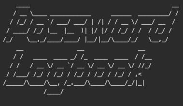

# Password Logger
> Secure Java Password Logbook Application

One to two paragraph statement about your product and what it does.

## Usage example

A few motivating and useful examples of how your product can be used. Spice this up with code blocks and potentially more screenshots.

## Release History

* 0.2.1
    * Minor bug fixes
* 0.2.0
    * Finished all cases
* 0.1.1
    * Password encryption and decryption added
* 0.1.0
    * The first proper release
    * Initial classes added
* 0.0.1
    * Work in progress

## License

This project is licensed under the MIT License - see the [LICENSE.md](LICENSE.md) file for details

## More Info
**James Rupa**\
Brooklyn College Computer Science Major

* Twitter - [@jamesrupaa](https://twitter.com/jamesrupaa)
* Instagram - [@jamesrupaa](https://instagram.com/jamesrupaa)
* Linkedin - [@jamesrupa](https://www.linkedin.com/in/jamesrupa)

[See All GitHub Repositories](https://github.com/jamesrupa?tab=repositories)

Thanks for all the support!
